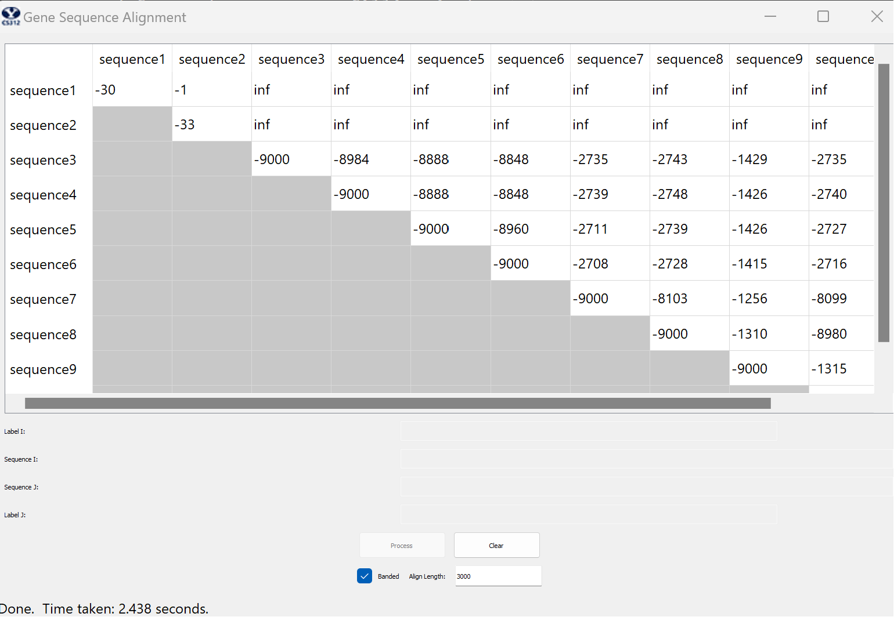

# Project 4 - Gene Sequencing
## Justin Olcott

## 1 Code
- see appedix

## 2 Time and Space Complexity
### Unrestricted
```
def computeEditDistance(self, seq1, seq2):
    rows = len(seq1) + 1
    cols = len(seq2) + 1
    matrix = {}
    prev = {}
```
- This is the start of the function and so far the time complexity is constant as long as computing the length is constant. The space complexity is constant so far since we are just initializing values.
```

    # set vals in the first row
    for i in range(rows):
        matrix[i,0] = i*INDEL
        prev[i,0] = (i-1,0)
    # set vals in the first column
    for j in range(cols):
        matrix[0,j] = j*INDEL
        prev[0,j] = (0,j-1)
```
- Here we are filling in the first row and column, so the time and space complexity is O(n + m) since we are filling in n values for the row and m values for the column.
```
    # fill in the rest of the matrix
    # aka for each row
    for i in range(1,rows):
        # and for each column
        for j in range(1,cols):
            # Fill in the value
```
- here you can see we are in a double nested loop where for each row we loop through each column which gives us O(m*n) for both time and space where m and n correspond to rows and columns.
```
            # Find the diagonal distance
            # if equal, take match
            # if not equal, take substitution
            diagonal = float('inf')
            if seq1[i-1] == seq2[j-1]:
                diagonal = matrix[i-1,j-1]+MATCH
            else:
                diagonal = matrix[i-1,j-1]+SUB

            # find the up and left distance
            up = matrix[i-1,j]+INDEL
            left = matrix[i,j-1]+INDEL

            # set it to the minimum of the three
            matrix[i,j] = min(diagonal,up,left)

            # set the previous node in the prev dictionary
            # with the left then up then diagonal if they're all the same
            if matrix[i,j] == left:
                prev[i,j] = (i,j-1)
            elif matrix[i,j] == up:
                prev[i,j] = (i-1,j)
            else:
                prev[i,j] = (i-1,j-1)		
    return matrix[rows-1,cols-1], prev
```
- Inside the loop, all we ever do are constant operations such as looking up values in a dictionary, assigning values, or finding the minimum of three values, so our complexity remains the same: O(m*n).
- The Space and Time complexity is O(mn) because we are filling in every cell of a matrix of size m x n and each operation of filling in a cell is constant in both time and space.


### Banded
```
def computeEditDistanceBanded(self, seq1, seq2, n=MAXINDELS):
    rows = len(seq1) + 1
    cols = len(seq2) + 1
    matrix = {}
    prev = {}
```
- Here we are just initializing values, so the complexity is constant so far.
```
    # set vals in the first row and column
    # it won't be the full values, just the ones that are in the band
    for i in range(n+1):
        matrix[i,0] = i*INDEL
        prev[i,0] = (i-1,0)
    for j in range(n+1):
        matrix[0,j] = j*INDEL
        prev[0,j] = (0,j-1)
```
- Here we are just filling in the first row and column, but this time we are only filling in the first n/k cells, so the complexity is O(k) so far where k is the max indels.
```
    # for all the rows
    for i in range(1,rows):
        # and for the columns within the band
        for j in range(i-n,i+n+1):
```
- We have two nested loops, but this time we loop through every row, and for each row we only loop through 2k (2n in my code) columns. It is 2k because one side represents a max of k inserts and the other side if k deletes. This gives us a time complexity of O(kn). 
```
            # if it's out of bounds, skip it
            if j < 1 or j > cols-1:
                continue
            
            # diagonal will always exist
            d = matrix[i-1,j-1]

            # left and right will only exist if they're in the band, so we init to inf
            u = float('inf')
            l = float('inf')

            # if they're in the matrix, set them to the value
            if (i-1,j) in matrix:
                u = matrix[i-1,j]
            if (i,j-1) in matrix:
                l = matrix[i,j-1]
            
            # Find the diagonal distance
            diagonal = d+SUB
            # If they're equal, take the match
            if seq1[i-1] == seq2[j-1]:
                diagonal = d+MATCH
            
            # find the up and left distance
            up = u+INDEL
            left = l+INDEL

            # take the minimum of the directions
            matrix[i,j] = min(diagonal,up,left)

            # set the previous node in the prev dictionary
            # with the left then up then diagonal if they're all the same
            if matrix[i,j] == left:
                prev[i,j] = (i,j-1)
            elif matrix[i,j] == up:
                prev[i,j] = (i-1,j)
            else:
                prev[i,j] = (i-1,j-1)
    
    # if we can reach the end, return the value
    if (rows-1, cols-1) in matrix:
        return matrix[rows-1,cols-1], prev
    # else return infinity
    else:
        return float('inf'), None
```
- All of the operations inside the loop are constant such as looking up values in a dictionary, assigning values, finding the minimum of three values, etc, so the time complexity is still O(kn). Inside this loop, we are saving a singular value each time, so the space complexity is O(kn) too.
- Essentially we are going through every row, and for each row we are filling in k cells where each cell takes constant space and time to fill, so the space and time complexity is O(kn).

## 3 Screenshots
### Unrestricted


### Banded


## 4 Alignment
### Unrestricted
Sequence #3 is on top, #10 is on bottom


```
gattgcgagcgatttgcgtgcgtgcatcccgcttc-actg--at-ctcttgttagatcttttcataatctaaactttataaaaacatccactccctgta-

-ataa-gagtgattggcgtccgtacgtaccctttctactctcaaactcttgttagtttaaatc-taatctaaactttataaa--cggc-acttcctgtgt
```

### Banded
Sequence #3 is on top, #10 is on bottom

```
gattgcgagcgatttgcgtgcgtgcatcccgcttc-actg--at-ctcttgttagatcttttcataatctaaactttataaaaacatccactccctgta-

-ataa-gagtgattggcgtccgtacgtaccctttctactctcaaactcttgttagtttaaatc-taatctaaactttataaa--cggc-acttcctgtgt
```

## 1 Source Code Appendix
```
def computeEditDistance(self, seq1, seq2):
    rows = len(seq1) + 1
    cols = len(seq2) + 1
    matrix = {}
    prev = {}

    # set vals in the first row
    for i in range(rows):
        matrix[i,0] = i*INDEL
        prev[i,0] = (i-1,0)
    # set vals in the first column
    for j in range(cols):
        matrix[0,j] = j*INDEL
        prev[0,j] = (0,j-1)
    
    # fill in the rest of the matrix
    # aka for each row
    for i in range(1,rows):
        # and for each column
        for j in range(1,cols):
            # Fill in the value

            # Find the diagonal distance
            # if equal, take match
            # if not equal, take substitution
            diagonal = float('inf')
            if seq1[i-1] == seq2[j-1]:
                diagonal = matrix[i-1,j-1]+MATCH
            else:
                diagonal = matrix[i-1,j-1]+SUB

            # find the up and left distance
            up = matrix[i-1,j]+INDEL
            left = matrix[i,j-1]+INDEL

            # set it to the minimum of the three
            matrix[i,j] = min(diagonal,up,left)

            # set the previous node in the prev dictionary
            # with the left then up then diagonal if they're all the same
            if matrix[i,j] == left:
                prev[i,j] = (i,j-1)
            elif matrix[i,j] == up:
                prev[i,j] = (i-1,j)
            else:
                prev[i,j] = (i-1,j-1)		
    return matrix[rows-1,cols-1], prev

def computeEditDistanceBanded(self, seq1, seq2, n=MAXINDELS):
    rows = len(seq1) + 1
    cols = len(seq2) + 1
    matrix = {}
    prev = {}

    # set vals in the first row and column
    # it won't be the full values, just the ones that are in the band
    for i in range(n+1):
        matrix[i,0] = i*INDEL
        prev[i,0] = (i-1,0)
    for j in range(n+1):
        matrix[0,j] = j*INDEL
        prev[0,j] = (0,j-1)
    
    # for all the rows
    for i in range(1,rows):
        # and for the columns within the band
        for j in range(i-n,i+n+1):
            # if it's out of bounds, skip it
            if j < 1 or j > cols-1:
                continue
            
            # diagonal will always exist
            d = matrix[i-1,j-1]

            # left and right will only exist if they're in the band, so we init to inf
            u = float('inf')
            l = float('inf')

            # if they're in the matrix, set them to the value
            if (i-1,j) in matrix:
                u = matrix[i-1,j]
            if (i,j-1) in matrix:
                l = matrix[i,j-1]
            
            # Find the diagonal distance
            diagonal = d+SUB
            # If they're equal, take the match
            if seq1[i-1] == seq2[j-1]:
                diagonal = d+MATCH
            
            # find the up and left distance
            up = u+INDEL
            left = l+INDEL

            # take the minimum of the directions
            matrix[i,j] = min(diagonal,up,left)

            # set the previous node in the prev dictionary
            # with the left then up then diagonal if they're all the same
            if matrix[i,j] == left:
                prev[i,j] = (i,j-1)
            elif matrix[i,j] == up:
                prev[i,j] = (i-1,j)
            else:
                prev[i,j] = (i-1,j-1)
    
    # if we can reach the end, return the value
    if (rows-1, cols-1) in matrix:
        return matrix[rows-1,cols-1], prev
    # else return infinity
    else:
        return float('inf'), None
		
# Function for finding the string alignment
def findAlign(self, prev, seq1, seq2):
    # if there's no alignment, return None in case of not making it to the end
    if prev == None:
        return "No Alignment Possible.","No Alignment Possible."
    
    i = len(seq1)
    j = len(seq2)
    align1 = ""
    align2 = ""

    # while we're not at the beginning empty cell
    while i > 0 or j > 0:
        if j == prev[i,j][1]: # if it came from the top aka same column
            align1 = seq1[i-1] + align1
            align2 = "-" + align2
            i, j = prev[i,j]
        elif i == prev[i,j][0]: # if it came from the left aka same row
            align1 = "-" + align1
            align2 = seq2[j-1] + align2
            i, j = prev[i,j]
        else: # if diagonal, not same col or row, and we can take both
            align1 = seq1[i-1] + align1
            align2 = seq2[j-1] + align2
            i, j = prev[i,j]
    return align1, align2
```